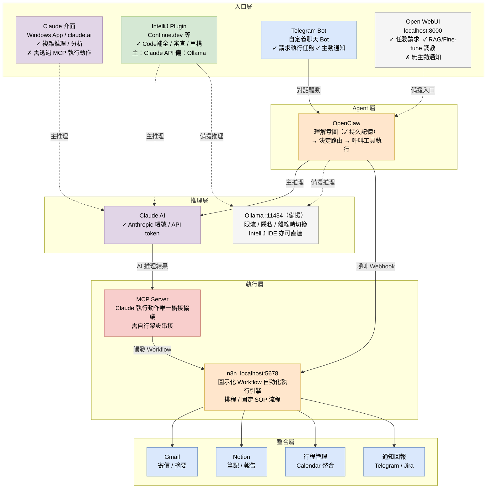
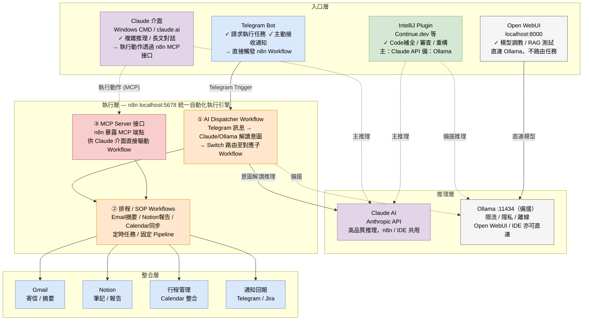

# Local AI 架構圖

> 由 `localAI_architecture.drawio` 轉換而來。

---

## V1（含 OpenClaw Agent 層）

```mermaid
flowchart TD
    classDef purple fill:#E1D5E7,stroke:#9673A6,color:#000
    classDef green  fill:#D5E8D4,stroke:#82B366,color:#000
    classDef blue   fill:#DAE8FC,stroke:#6C8EBF,color:#000
    classDef gray   fill:#F5F5F5,stroke:#666,color:#000
    classDef orange fill:#FFE6CC,stroke:#D6B656,color:#000
    classDef red    fill:#F8CECC,stroke:#B85450,color:#000

    subgraph ENTRY["入口層"]
        CLAUDE_UI["Claude 介面\nWindows App / claude.ai\n✓ 複雜推理 / 分析\n✗ 需透過 MCP 執行動作"]
        INTELLIJ["IntelliJ Plugin\nContinue.dev 等\n✓ Code補全 / 審查 / 重構\n主：Claude API  備：Ollama"]
        TELEGRAM["Telegram Bot\n自定義聊天 Bot\n✓ 請求執行任務  ✓ 主動通知"]
        OPENWEBUI["Open WebUI\nlocalhost:8000\n✓ 任務請求  ✓ RAG/Fine-tune 調教\n✗ 無主動通知"]
    end

    subgraph AGENT["Agent 層"]
        OPENCLAW["OpenClaw\n理解意圖（✓ 持久記憶）\n→ 決定路由 → 呼叫工具執行"]
    end

    subgraph INFERENCE["推理層"]
        CLAUDE_AI["Claude AI\n✓ Anthropic 帳號 / API token"]
        OLLAMA["Ollama :11434（備援）\n限流 / 隱私 / 離線時切換\nIntelliJ IDE 亦可直連"]
    end

    subgraph EXEC["執行層"]
        MCP["MCP Server\nClaude 執行動作唯一橋接協議\n需自行架設串接"]
        N8N["n8n  localhost:5678\n圖示化 Workflow 自動化執行引擎\n排程 / 固定 SOP 流程"]
    end

    subgraph INTEGRATION["整合層"]
        GMAIL["Gmail\n寄信 / 摘要"]
        NOTION["Notion\n筆記 / 報告"]
        CAL["行程管理\nCalendar 整合"]
        NOTIFY["通知回報\nTelegram / Jira"]
    end

    CLAUDE_UI  -. "主推理" .->        CLAUDE_AI
    INTELLIJ   -. "主推理" .->        CLAUDE_AI
    INTELLIJ   -. "備援推理" .->      OLLAMA
    TELEGRAM    -- "對話驅動" --> OPENCLAW
    OPENWEBUI  -. "備援入口" .->      OPENCLAW
    OPENCLAW    -- "主推理" --> CLAUDE_AI
    OPENCLAW   -. "備援推理" .->      OLLAMA
    OPENCLAW    -- "呼叫 Webhook" --> N8N
    CLAUDE_AI   -- "AI 推理結果" --> MCP
    MCP         -- "觸發 Workflow" --> N8N
    N8N --> GMAIL
    N8N --> NOTION
    N8N --> CAL
    N8N --> NOTIFY

    class CLAUDE_UI,CLAUDE_AI purple
    class INTELLIJ green
    class TELEGRAM,GMAIL,NOTION,CAL,NOTIFY blue
    class OPENWEBUI,OLLAMA gray
    class OPENCLAW,N8N orange
    class MCP red
```

---

## V2（n8n 統一執行引擎版）

```mermaid
flowchart TD
    classDef purple fill:#E1D5E7,stroke:#9673A6,color:#000
    classDef green  fill:#D5E8D4,stroke:#82B366,color:#000
    classDef blue   fill:#DAE8FC,stroke:#6C8EBF,color:#000
    classDef gray   fill:#F5F5F5,stroke:#666,color:#000
    classDef orange fill:#FFE6CC,stroke:#D79B00,color:#000
    classDef red    fill:#F8CECC,stroke:#B85450,color:#000

    subgraph ENTRY["入口層"]
        CLAUDE_UI["Claude 介面\nWindows CMD / claude.ai\n✓ 複雜推理 / 長文對話\n→ 執行動作透過 n8n MCP 接口"]
        INTELLIJ["IntelliJ Plugin\nContinue.dev 等\n✓ Code補全 / 審查 / 重構\n主：Claude API  備：Ollama"]
        TELEGRAM["Telegram Bot\n✓ 請求執行任務  ✓ 主動接收通知\n→ 直接觸發 n8n Workflow"]
        OPENWEBUI["Open WebUI\nlocalhost:8000\n✓ 模型調教 / RAG 測試\n直連 Ollama，不路由任務"]
    end

    subgraph INFERENCE["推理層"]
        CLAUDE_AI["Claude AI\nAnthropic API\n高品質推理，n8n / IDE 共用"]
        OLLAMA["Ollama :11434（備援）\n限流 / 隱私 / 離線\nOpen WebUI / IDE 亦可直連"]
    end

    subgraph N8N_EXEC["執行層 — n8n localhost:5678  統一自動化執行引擎"]
        DISPATCHER["① AI Dispatcher Workflow\nTelegram 訊息 → Claude/Ollama 解讀意圖\n→ Switch 路由至對應子 Workflow"]
        SOP["② 排程 / SOP Workflows\nEmail摘要 / Notion報告 / Calendar同步\n定時任務 / 固定 Pipeline"]
        MCP_SERVER["③ MCP Server 接口\nn8n 暴露 MCP 端點\n供 Claude 介面直接驅動 Workflow"]
        DISPATCHER --> SOP
        MCP_SERVER --> SOP
    end

    subgraph INTEGRATION["整合層"]
        GMAIL["Gmail\n寄信 / 摘要"]
        NOTION["Notion\n筆記 / 報告"]
        CAL["行程管理\nCalendar 整合"]
        NOTIFY["通知回報\nTelegram / Jira"]
    end

    CLAUDE_UI  -. "主推理" .->            CLAUDE_AI
    CLAUDE_UI  -. "執行動作 (MCP)" .->   MCP_SERVER
    INTELLIJ   -. "主推理" .->            CLAUDE_AI
    INTELLIJ   -. "備援推理" .->          OLLAMA
    TELEGRAM    -- "Telegram Trigger" --> DISPATCHER
    OPENWEBUI   -- "直連模型" --> OLLAMA
    DISPATCHER  -- "意圖解讀推理" --> CLAUDE_AI
    DISPATCHER -. "備援" .->              OLLAMA
    SOP --> GMAIL
    SOP --> NOTION
    SOP --> CAL
    SOP --> NOTIFY

    class CLAUDE_UI,CLAUDE_AI purple
    class INTELLIJ green
    class TELEGRAM,GMAIL,NOTION,CAL,NOTIFY blue
    class OPENWEBUI,OLLAMA gray
    class DISPATCHER,SOP orange
    class MCP_SERVER red
```
